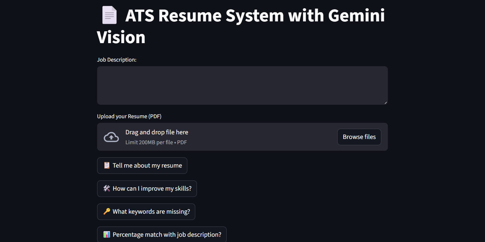

# 📄 ATS Resume Analyzer with Gemini Vision

An interactive **Streamlit app** powered by **Google Gemini 1.5** that analyzes resumes against job descriptions like an **ATS (Applicant Tracking System)**.  

👉 **Live Demo:** [ATS Resume System](https://yuvraj-tayal-ats-resume-system.streamlit.app/)  

---

## 🚀 Features
- Upload your **resume (PDF)**.  
- Paste a **job description**.  
- Get:
  - 📋 Resume Summary  
  - 🛠️ Skill Improvement Suggestions  
  - 🔑 Missing Keywords  
  - 📊 ATS Match % (with reasoning)  

---

## 📷 Screenshots

### Home Page


### Resume Uploaded & Job Description Entered


### ATS Analysis Result


*(Add screenshots in a `screenshots/` folder inside the repo)*

---

## 🛠️ Tech Stack
- [Streamlit](https://streamlit.io/) – UI framework  
- [Google Gemini 1.5 Flash](https://ai.google.dev/) – LLM for analysis + OCR  
- [pdf2image](https://pypi.org/project/pdf2image/) – Convert PDF pages into images  
- [pdfplumber](https://github.com/jsvine/pdfplumber) – Extract text from text-based PDFs  
- [dotenv](https://pypi.org/project/python-dotenv/) – Manage API keys  

---

## ⚙️ Installation

1. Clone the repo:
   ```bash
   git clone https://github.com/<your-username>/ATS-Resume-System.git
   cd ATS-Resume-System

2. Create a virtual environment and install dependencies:
   pip install -r requirements.txt

3. Add your Google API key in a .env file:
   GOOGLE_API_KEY=your_api_key_here

4. Run the app:
   streamlit run app.py


📬 Connect

👨‍💻 Author: Yuvraj Tayal

Portfolio : [Link](https://yuvraj-portfolio-seven.vercel.app/)

🔗 LinkedIn: [linkedin.com/in/yuvraj-tayal](https://www.linkedin.com/in/yuvraj-tayal-7a3a48356)

🐦 Twitter: [twitter.com/yuvrajtayal](https://x.com/YuvrajTayal)